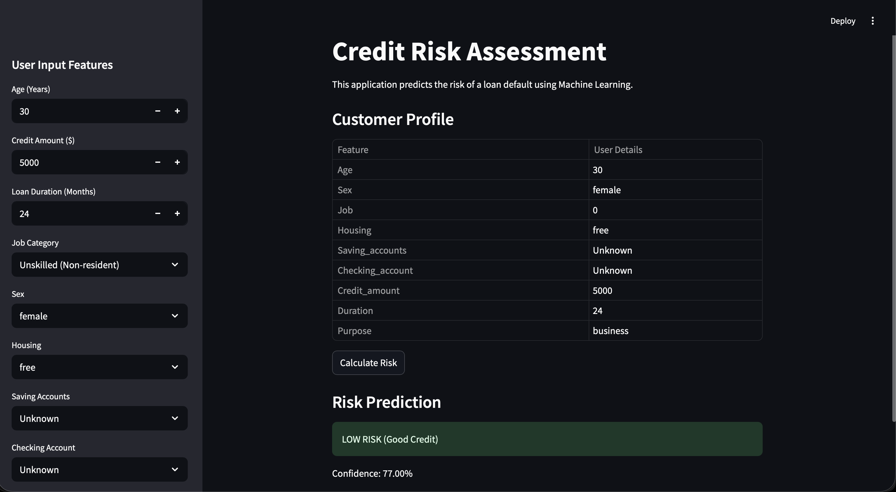
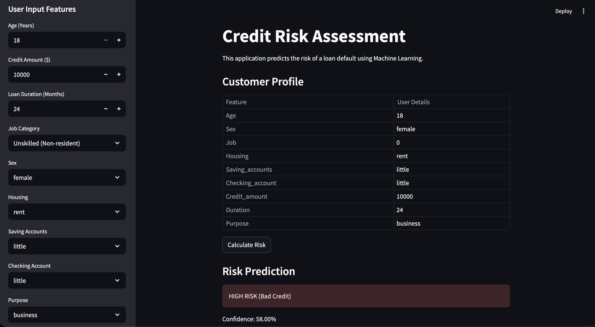

# Credit Risk ML Project

This project is an end-to-end credit risk prediction system built using Python and machine learning.

The goal of the project is to simulate how financial institutions assess the risk associated with lending money to customers, using structured customer and loan data.

---

## Project Overview

The project covers the complete machine learning workflow:
- Loading raw data into a MySQL database
- Preprocessing and cleaning data
- Encoding categorical features
- Training a machine learning model
- Saving the trained model and encoders
- Using the saved model for future predictions

The focus of the project is correctness, clarity, and understanding of the ML pipeline rather than heavy optimization.

---

## Project Structure
```text
credit-risk-ml/
├── app/
│   └── app.py              
├── data/
│   └── raw_data.csv  
├── models/
│   └── credit_risk_model.pkl  
├── src/
│   ├── build_db.py         
│   └── model.py            
├── screenshots/            
│   ├── app_ui_low.png
│   └── app_ui_high.png
├── requirements.txt        
└── README.md              

---

## Data Flow

1. Raw data is read from a CSV file.
2. The data is loaded into a MySQL database using `build_db.py`.
3. Data is fetched from the database for training.
4. Categorical features are encoded using Label Encoding.
5. A Random Forest classifier is trained to predict credit risk.
6. The trained model and encoders are saved using Joblib.

---

## Machine Learning Model

- Algorithm: Random Forest Classifier
- Train/Test Split: 80/20
- Evaluation Metric: Accuracy

Encoders used during training are saved along with the model to ensure consistent preprocessing during inference.

---

## How to Run the Project Locally

### Prerequisites
- Python 3.x
- MySQL installed and running
- Required Python packages listed in `requirements.txt`

### Steps

```bash
# 1. Clone the repository
git clone https://github.com/your-username/credit-risk-ml.git
cd credit-risk-ml

# 2. Install dependencies
pip install -r requirements.txt

# 3. Set the MySQL password as an environment variable
export DB_PASSWORD="your_mysql_password"

# 4. Build the database and load data
python src/build_db.py

# 5. Train the model
python src/model.py

# 6. Run the application
streamlit run app/app.py
```

---

## Security Note

Database credentials are **not hardcoded** in the source code.  
The MySQL password is read from an environment variable (`DB_PASSWORD`) to avoid exposing sensitive information.

---
## Screenshots

Below are sample outputs from the application demonstrating different credit risk predictions.

### Low Risk Prediction


### High Risk Prediction


## Technologies Used

- Python
- Pandas
- Scikit-learn
- MySQL
- Joblib

---

## Author

Hardik Bhagtani  
BTech Computer Science Engineering (First Year)
